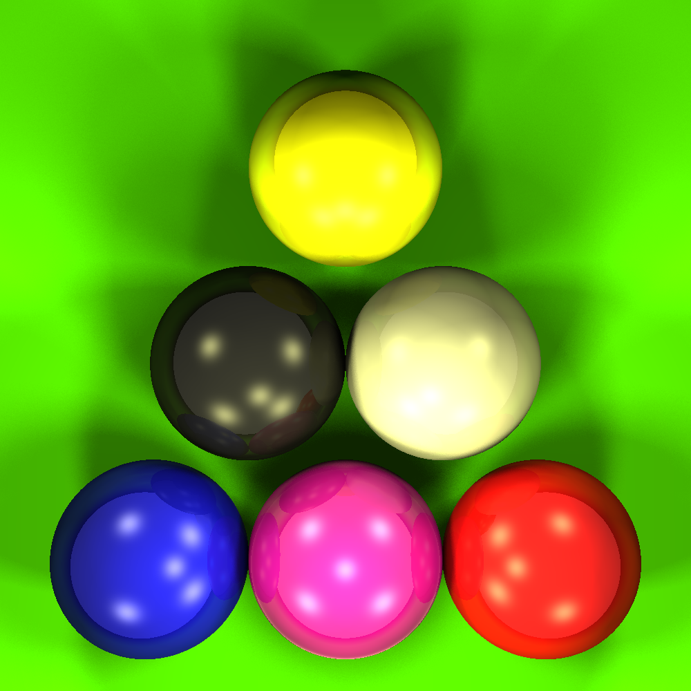
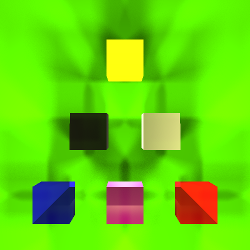
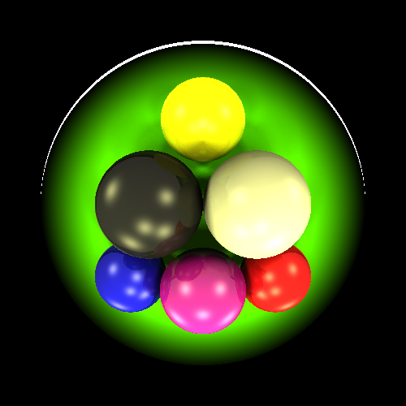
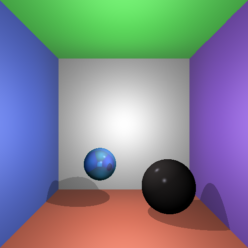
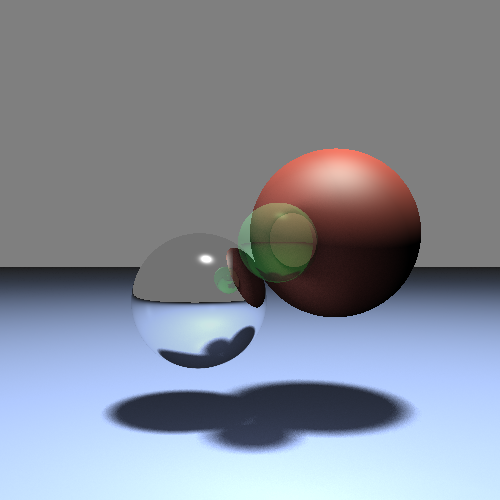
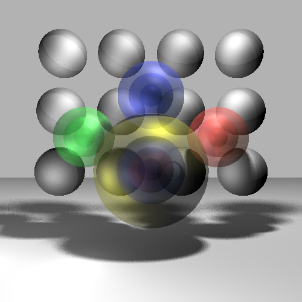

# Ray Tracing

This project was built as part of "Graphics basics and image processing" course in Tel-Aviv University.

## :page_with_curl: General description
This is an implementation of a basic ray tracer in Java. A ray tracer shoots rays from the observer's eye (the camera) through a screen and into a scene which contains
one or more surfaces. It calculates the rays intersection with the surfaces, finds the nearest intersection and calculates the color of the surface according to its material
and lighting conditions.

## :inbox_tray: Input 
The input file represent a scene. 
The first parameter is the scene file, and the second is the name of the image file to write. Those two are mandatory. 
The next two parameters are optional and define the image width and height, respectively. The default size is set to 500x500.<br/>
For example:
```
java -jar RayTrace.jar scenes\Spheres.txt scenes\Spheres.png 500 500
```
The scenes are defined in text scene files with the following format: 
  * Every line in the file defines a single object in the scene, and starts with a 3 letter code that identifies the object type. 
  * After the 3 letter code a list of numeric parameters is given. 
  * The parameters can be delimited by any number of white space characters, and are parsed according to the 
     specific order in which they appear. Empty lines are discarded, and so are lines which begin with the character "#" which are used for remarks. 
  * The possible objects with their code and list of required parameters are given in the following file: TODOOOOOOOOOOOOOOOOOOOOOOOOOOOOOOOOOOOOOOOOO
    

## :outbox_tray: Output
The rendered scene (.png file).

## :sunrise: Surfaces
* **Spheres** - Each sphere is defined by the position of its center and its radius
* **Infinite Planes** - Each plane is defined by its normal N and an offset c along the normal. A point on the P plane will satisfy the formula P⋅N = c.
* **Boxes** (cubes). Each box is defined by the position of its center (x, y, z) and its edge length (scalar). All boxes are axis aligned (meaning no rotations) to make the computation of intersections easier.

## 🌈 Special Features
* **Soft Shadows**: To generate soft shadows, we will send several shadow rays from the light source to a point on the surface. The light intensity that hits the surface from this light source will be multiplied by the number of rays that hit the surface divided by the total number of rays we sent. The sent rays should simulate a light which has a certain area, Each light is defined with a light radius.
* **Fisheye Model**: The fisheye lenses give an artistic effect to images. A fisheye lens that is positioned at the camera position, “deforms” the incoming rays from the image plane, therefore we should account for that deformation with regards to the sensor plane.

## 🎆 Results
<p align="center">
 
   
 
</p>
<p align="center">
   
 
 
</p>


## :ok_woman: Team Members
Rotem Brooks -  rotembr10@gmail.com <br/>
Shai Liran - shailiran@gmail.com
